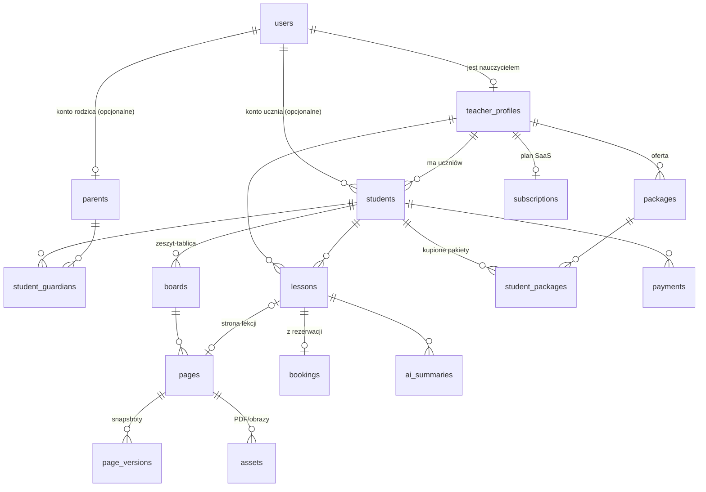

# Architektura i rekomendacja technologii

> Odpowiedź na [ROADMAP.md, sekcja 9](../ROADMAP.md#9-zadanie-dla-agenta-rekomendacja-technologii).
> Stan na **26.09.2026**. Ceny i licencje sprawdzono tego dnia na stronach dostawców (źródła na końcu). Wszystko, czego nie udało się potwierdzić, jest oznaczone **⚠️ do weryfikacji**.

## Streszczenie w 10 punktach

1. **Web app w Next.js + TypeScript**, jeden język w całym projekcie. Stylowanie: **Tailwind CSS** z tokenami z prototypu i **shadcn/ui** przestylizowanym na „playful bold”.
2. **Silnik tablicy: rozwijamy własny silnik Canvas 2D z prototypu**, wspierany małymi bibliotekami MIT (perfect-freehand, rbush, pdf.js, MathLive, MathJax). tldraw jest najlepszy technicznie, ale licencja komercyjna kosztuje ok. **6000 USD/rok** i nie mieści się w budżecie. **Konva** to plan B, jeśli test wydajności wypadnie źle.
3. **Synchronizacja: Yjs + Hocuspocus na własnym serwerze w UE.** Daje tryb offline (y-indexeddb), scalanie zmian bez konfliktów, undo per użytkownik, obecność i kursory. Jest open source (MIT), więc nie wiąże nas z dostawcą.
4. **Jeden dokument Yjs na jedną stronę tablicy**, a nie na całą tablicę. Strony pozostają małe, uprawnienia i wersje działają per strona, a ładowanie jest szybkie.
5. **Supabase w regionie UE (Frankfurt)**: Postgres, logowanie (magic link + Google) i pliki. Schemat bazy i zapytania przez **Drizzle ORM**. Uprawnienia sprawdza **jedna funkcja na serwerze**, używana zarówno przez API, jak i przez serwer synchronizacji.
6. **Płatności: Stripe.** Subskrypcja nauczyciela przez Stripe Billing (karta; BLIK cykliczny jest w private preview). Płatności uczniów w Etapie 2 najpierw jako **śledzenie statusu + linki płatności**, później **Stripe Connect**.
7. **Wideo: na start link do Meet/Zoom.** Wbudowane wideo później, przez **LiveKit** (open source, własny serwer lub chmura).
8. **AI: Claude.** Sonnet 5 do podsumowań i zadań, Haiku 4.5 do tanich operacji. Do modelu trafia **tekst wyciągnięty z tablicy + obraz strony (PNG)**, a dane ucznia są pseudonimizowane. **Bezpośrednie API Claude nie oferuje dziś przetwarzania w UE**. Jeśli wymagane jest przetwarzanie w UE, trzeba użyć Claude przez **AWS Bedrock (Frankfurt)** lub **Google Vertex AI (region UE)**. To pytanie otwarte nr 5.
9. **Hosting w UE:** Vercel (funkcje w regionie `fra1`), Supabase (Frankfurt), Hocuspocus na małym VPS Hetzner (Niemcy/Finlandia). Monitoring: **Sentry** (region UE). Analityka: **PostHog EU**.
10. **Koszt startowy ok. 55–70 USD/mies.** Wariant oszczędny (Next.js na tym samym VPS) to ok. 35 USD. Największe pozycje przy skali to **AI i SMS**. Oba trzeba limitować w planach cenowych.

---

## 0. Punkt wyjścia: co jest dziś w repozytorium

Sekcja 3 ROADMAP-u opisuje wcześniejszą wersję prototypu (`server.js`, `public/`, vanilla JS). Od tamtej pory kod się zmienił:

| Część | Stan obecny |
|---|---|
| `frontend/` | React 19 + TypeScript + Vite. Silnik tablicy to klasa `BoardEngine` w [`src/board/engine.ts`](../frontend/src/board/engine.ts): Canvas 2D, narzędzia, undo, kamera, spotlight. Geometria i hit-testing są w [`geometry.ts`](../frontend/src/board/geometry.ts), rysowanie elementów w [`render.ts`](../frontend/src/board/render.ts). Stan UI trzyma zustand ([`store.ts`](../frontend/src/store.ts)), a komponenty są w `src/components/`. |
| `backend/` | Node + Express + helmet + `ws`. Każda wiadomość jest walidowana przez zod ([`schema.js`](../backend/src/schema.js)). Pokoje są trzymane w pamięci i zapisywane do `data/<room>.json` ([`rooms.js`](../backend/src/rooms.js)). |
| Protokół | Własny: `join`, `upsert`, `delete`, `clear`, `cursor`, `follow`. Konflikty rozstrzyga zasada „ostatni zapis wygrywa” (last-write-wins), na poziomie całego elementu. Nie ma trybu offline. |
| Brakuje | Kont, bazy danych, autoryzacji, stron, wersjonowania, plików, trybu offline i obsługi rysika. Rolę nauczyciela nadal może wybrać każdy. |

Wniosek: **UI, styl, geometria i logika narzędzi są warte przeniesienia.** Warstwę danych, synchronizację i serwer trzeba zbudować od nowa (szczegóły w sekcji 4).

---

## 1. Rekomendowany stack

### 1.1 Frontend

| Obszar | Wybór | Dlaczego |
|---|---|---|
| Framework | **Next.js (App Router) + React + TypeScript** | Najpopularniejszy framework React, więc modele AI znają go najlepiej. W jednym projekcie mieści: stronę publiczną (SEO dla profilu nauczyciela i linku rezerwacji w Etapach 2 i 4), panel nauczyciela, API i webhooki Stripe. Tablica jest komponentem działającym wyłącznie po stronie klienta (`"use client"`), więc SSR jej nie przeszkadza. |
| Stylowanie | **Tailwind CSS** + tokeny z prototypu (`--ink`, `--paper`, paleta, cienie, promienie, fonty) + **shadcn/ui** | shadcn/ui daje dostępne komponenty (dialogi, menu, kalendarz, formularze) jako kod, który mamy u siebie i możemy przestylizować na „playful bold”. Obecny CSS tablicy (dock, bąbel stylu, kursory) przenosimy najpierw bez zmian, a przepisujemy stopniowo. |
| Stan UI tablicy | **zustand** (jak dziś) | Jest już w kodzie, prosty i dobrze udokumentowany. |
| Stan dokumentu tablicy | **Yjs** (sekcja 1.3) | Dokument tablicy żyje w Yjs, a nie w zustand. |
| Dane aplikacji (uczniowie, lekcje) | **React Server Components + Server Actions**, walidacja **zod**, formularze **react-hook-form** | Mniej kodu niż osobne REST API z klientem. TanStack Query dodajemy dopiero, gdy pojawi się potrzeba (np. odświeżanie kalendarza). |
| Daty i strefy czasowe | **date-fns** + `date-fns-tz` | Lekcje cykliczne i przypomnienia muszą poprawnie obsługiwać zmianę czasu. |
| i18n | Na start tylko PL. Teksty od początku trzymamy w plikach (**next-intl**). | Etap 4 zakłada EN; wyciąganie tekstów później jest dużo droższe. |

### 1.2 Silnik tablicy

**Rekomendacja: własny silnik Canvas 2D** (ewolucja `BoardEngine` z prototypu) + wyspecjalizowane biblioteki MIT:

| Potrzeba z ROADMAP | Rozwiązanie |
|---|---|
| Siła nacisku rysika, płynne linie | **perfect-freehand** (MIT): obrys linii o zmiennej grubości z `PointerEvent.pressure`. |
| Odrzucanie dłoni | Tryb „tylko rysik”: gdy pojawi się `pointerType === 'pen'`, dotyk (`touch`) służy tylko do przesuwania i przybliżania, nigdy do rysowania. |
| 60 fps przy ponad 5000 elementach | Indeks przestrzenny **rbush** (MIT) do cullingu i hit-testów. Statyczne elementy trzymamy w buforze (offscreen canvas), a co klatkę rysujemy tylko element w trakcie tworzenia. Test w zadaniu 1.4 planu. |
| PDF i zdjęcia | **pdfjs-dist** (Apache-2.0): przy wgrywaniu renderujemy strony PDF do obrazów (WebP) i dodajemy je jako elementy lub tło strony. |
| Wzory LaTeX | **MathLive** (MIT) jako edytor wzoru, **MathJax** (Apache-2.0, wyjście SVG) do renderowania na canvasie jako obraz trzymany w cache. KaTeX nie generuje SVG, więc trudniej narysować go na canvasie. |
| Wykres funkcji | Parser **mathjs** (Apache-2.0) + własne rysowanie próbek na canvasie (ok. 150 linii kodu). |
| Kratka, linie, linijka, kątomierz, karteczki | Własne typy elementów i narzędzi. Silnik ma już do tego strukturę. |
| Eksport PNG/PDF | `canvas.toBlob()` dla PNG, **pdf-lib** (MIT) do złożenia stron w PDF. |

**Dlaczego nie gotowa biblioteka?** Porównanie jest w [sekcji 2.1](#21-silnik-tablicy). W skrócie:

- tldraw ma wszystko, ale kosztuje ok. 6000 USD/rok. To więcej niż cały budżet infrastruktury na rok przy 100 nauczycielach.
- Excalidraw narzuca swój wygląd („ręcznie rysowany”) i UI, a trudno w nim dodawać własne typy elementów.
- Konva (MIT) jest rozsądną alternatywą: daje uchwyty transformacji, warstwy i zdarzenia. Nie rozwiązuje jednak synchronizacji, PDF ani LaTeX, a przy 5000 węzłach wymaga strojenia.
- Własny silnik już działa, ma nasz unikalny UI, a kod jest w TypeScript i dobrze rozumiany przez AI.

**Warunek:** jeśli test wydajności na iPadzie (zadanie 1.4) nie da 60 fps przy 5000 elementach po dodaniu rbush i buforowania, przechodzimy na Konva. Warstwę UI (React) i model danych (Yjs) da się wtedy zachować.

### 1.3 Synchronizacja na żywo

**Rekomendacja: Yjs + Hocuspocus** (oba MIT) na własnym serwerze Node w UE.

- **Model danych:** jedna strona to jeden `Y.Doc`. W nim `Y.Map` z elementami (`id` → dane elementu) i kolejność rysowania przez indeks ułamkowy (`fractional-indexing`, MIT), dzięki czemu dwie osoby mogą jednocześnie zmieniać kolejność bez konfliktu.
- **Offline:** `y-indexeddb` trzyma kopię strony w przeglądarce. Zmiany z czasu rozłączenia scalają się same po powrocie sieci. Spełnia to wymaganie „zero utraty danych przy rozłączeniu”.
- **Undo/redo:** `Y.UndoManager` z filtrem na lokalne zmiany. Każdy cofa tylko swoje ruchy, co jest poprawnym zachowaniem przy współpracy i działa lepiej niż obecny wspólny stos undo.
- **Obecność, kursory, Spotlight:** protokół Awareness z Yjs, wbudowany w Hocuspocus.
- **Autoryzacja:** hook `onAuthenticate` weryfikuje token Supabase (JWT) i wywołuje tę samą funkcję `canAccessPage(user, pageId)`, której używa API. Uczeń bez dostępu nie dostaje połączenia. Strona zablokowana przez nauczyciela jest otwierana w trybie **tylko do odczytu** (`connection.readOnly`).
- **Zapis:** rozszerzenie `@hocuspocus/extension-database` zapisuje stan binarny Yjs do Postgresa (kolumna `bytea`) z opóźnieniem kilku sekund. Dodatkowo co N minut i na koniec lekcji zapisujemy **snapshot do `page_versions`**, co daje wersjonowanie i przywracanie.
- **Skalowanie:** jeden proces Node obsłuży setki jednoczesnych pokoi. Przy wielu instancjach dochodzi rozszerzenie Redis (`@hocuspocus/extension-redis`).

**Ograniczenie CRDT, które trzeba znać:** Yjs sprawdza uprawnienia na poziomie połączenia (czytanie lub pisanie), a nie pojedynczej operacji. Uczeń z prawem zapisu technicznie może usunąć wszystkie elementy strony, także te dodane przez nauczyciela. Zabezpieczenia:

- wersje stron i przywracanie,
- „Clear” jako funkcja tylko dla nauczyciela w UI,
- blokowanie strony (read-only) przez nauczyciela,
- opcjonalnie w Etapie 2: warstwa nauczyciela jako osobny `Y.Doc`, w którym uczeń ma tylko odczyt.

Dla korepetycji 1:1 to akceptowalny kompromis.

### 1.4 Backend, API i baza danych

| Obszar | Wybór | Dlaczego |
|---|---|---|
| API | **Next.js** (Route Handlers + Server Actions) | Jeden projekt, jedno wdrożenie. Webhooki Stripe i zadania cron (przypomnienia) też tutaj. |
| Serwer sync | **Hocuspocus** jako osobna aplikacja Node (`apps/sync`) | WebSocket musi działać stale, a funkcje serverless (Vercel) tego nie obsługują. |
| Baza | **Postgres w Supabase (region Frankfurt)** | Dojrzały Postgres, a w tej samej usłudze logowanie i pliki. Codzienne backupy w planie Pro. |
| ORM | **Drizzle ORM** + drizzle-kit (migracje) | Schemat w TypeScript, zapytania bliskie SQL, bez dodatkowego silnika binarnego. Działa w Next.js i w serwerze sync. Prisma jest równie dobrym wyborem, jeśli wolisz jej styl. |
| Zadania w tle | **Cron w Vercel** lub pętla w procesie `apps/sync`; później **pg-boss** (kolejka w Postgresie) | Przypomnienia, snapshoty, generowanie podsumowań AI. Bez Redisa na start. |
| Uprawnienia | Moduł `packages/auth` z funkcjami `can(user, action, resource)`, testowany jednostkowo. **RLS w Supabase włączony z polityką „odmów wszystkiego”** dla publicznego API. | Jedno miejsce z regułami. RLS chroni przed przypadkowym wystawieniem tabel przez publiczne API Supabase. |

Proponowana struktura repozytorium (npm workspaces, które już mamy):

```
apps/web       Next.js: strony, panel, API, webhooki
apps/sync      Hocuspocus: WebSocket + zapis Yjs do Postgresa
packages/board silnik tablicy (przeniesiony z frontend/src/board) + komponenty tablicy
packages/db    schemat Drizzle, migracje
packages/auth  reguły uprawnień (wspólne dla web i sync)
packages/shared typy i schematy zod
```

### 1.5 Autoryzacja (logowanie)

**Rekomendacja: Supabase Auth.** Magic link + Google. Dane w tym samym regionie UE co baza. W planie Free 50 000 MAU, w Pro 100 000.

- Uczniowie **bez e-maila** (młodsze dzieci): konto zakładane przez nauczyciela i logowanie linkiem lub kodem, który nauczyciel przekazuje rodzicowi. Wymaga decyzji, patrz pytanie 1.
- **Zgoda rodzica (poniżej 16 lat):** osobny proces. E-mail do rodzica, link, akceptacja, zapis w `consents` (kto, kiedy, jaka wersja dokumentu).
- Wysyłka e-maili logowania przez własny SMTP (Resend). Domyślny SMTP Supabase ma niskie limity i nie nadaje się na produkcję.

Alternatywy: **Clerk** ma najlepsze gotowe UI, ale nie potwierdziłem hostingu danych w UE (⚠️ do weryfikacji), a przy wzroście jest płatny (Pro 25 USD/mies.). **Auth.js** jest darmowy, ale więcej rzeczy trzeba zrobić i utrzymać samemu (sesje, magic link, tabele).

### 1.6 Pliki (PDF, obrazy)

**Supabase Storage** (region UE, 100 GB w Pro, podpisane URL-e z krótkim czasem ważności). Ścieżki plików zawierają `teacher_id/board_id/…`, a dostęp sprawdza ta sama funkcja uprawnień.

Później, jeśli transfer wychodzący (egress) zacznie drożeć: **Cloudflare R2** (brak opłat za egress). Interfejs S3 pozwala zmienić dostawcę bez przepisywania aplikacji.

Limity: PDF do 20 MB, obrazy do 10 MB. Obrazy kompresujemy do WebP po stronie klienta przed wysłaniem.

### 1.7 Płatności

To dwa osobne przepływy pieniędzy:

**A. Subskrypcja SaaS (nauczyciel płaci nam), Etap 2:** **Stripe Billing + Checkout + Customer Portal.**

- Karta: 1,5% + 1 zł, a do tego Billing 0,7% (pay-as-you-go).
- **BLIK cykliczny jest w Stripe w „private preview”.** Na start: karta miesięcznie **lub** BLIK/P24 jednorazowo za plan roczny.
- Przelewy24 w Stripe **nie obsługuje płatności cyklicznych**.
- **Faktury VAT i KSeF:** Stripe nie wystawia polskich faktur zgodnych z KSeF. Potrzebna integracja z polskim systemem fakturowym (np. Fakturownia, inFakt) wywoływana z webhooka Stripe. ⚠️ Terminy obowiązku KSeF dla Twojej formy działalności trzeba sprawdzić: <https://ksef.podatki.gov.pl>.

**B. Płatności uczniów (rodzic płaci nauczycielowi), Etap 2:**

1. **Na start: bez pośredniczenia w pieniądzach.** Śledzimy statusy (opłacone / zaległe / pakiet: zostało X lekcji), wysyłamy przypomnienia, a nauczyciel podaje swój numer konta lub telefon do BLIK. Zero ryzyka prawnego (nie jesteśmy pośrednikiem płatniczym) i zero opłat.
2. **Potem: Stripe Connect** (konta Express, płatności typu direct lub z `on_behalf_of`). BLIK, P24 i karty działają z Connect. Przy modelu „Stripe handles pricing” nie ma dodatkowych opłat platformowych. Przy „You handle pricing” jest 2 EUR za aktywne konto miesięcznie + 0,25% + 0,10 EUR za wypłatę.

⚠️ **Ryzyko P24:** regulamin P24 w Stripe **zakazuje** kategorii „szkolnictwo wyższe i szkolenia zawodowe” (MCC 8220, 8241, 8244, 8249), a „usługi edukacyjne” (MCC 8299) są **ograniczone**. Korepetycje mogą wymagać dodatkowej weryfikacji. BLIK i karty nie mają takiego ograniczenia na liście. Sprawdź to ze Stripe przed Etapem 2.

### 1.8 Wideo

- **Etap 1: link zewnętrzny** (Google Meet / Zoom / Jitsi) zapisany w lekcji i widoczny jednym kliknięciem na tablicy. Nic nie kosztuje, a nauczyciele i tak znają te narzędzia.
- **Później: LiveKit.** Open source (Apache-2.0), więc można go hostować samemu na VPS w UE albo użyć LiveKit Cloud (plan Build darmowy, Ship 50 USD/mies.; ⚠️ cennik minut wideo i regiony UE do weryfikacji). Alternatywa: **Daily** (dojrzałe SDK, płatne za minuty uczestnika; ⚠️ cennik do weryfikacji). Jitsi self-host jest darmowy, ale trudniejszy w utrzymaniu i integracji z UI.

### 1.9 E-mail i SMS

| Kanał | Wybór | Koszt | Uwagi |
|---|---|---|---|
| E-mail | **Resend** + **React Email** (szablony w React) | Free: 3000/mies., limit 100/dzień. Pro: 20 USD za 50 000/mies. | Najprostsze API, dobrze znane AI. ⚠️ Region wysyłki w UE niepotwierdzony. Jeśli wymagany jest dostawca z UE: **Brevo** lub **Mailjet**. |
| SMS | **SMSAPI** (polska firma) | 0,14–0,17 zł netto/SMS + **abonament 49 zł netto/mies.** (wg cennika z 26.09.2026) | Twilio jest droższe dla polskich numerów. SMS-y **tylko w planie Pro albo z limitem**, bo przy skali to jedna z największych pozycji kosztowych (sekcja 5). |

### 1.10 AI

| Zadanie | Model | Szacunkowy koszt jednostkowy |
|---|---|---|
| Podsumowanie lekcji dla rodzica | **Claude Sonnet 5** (2 USD / 10 USD za 1 mln tokenów wejście/wyjście) | ok. 4000 tokenów wejścia (obraz strony + tekst + instrukcje) i 600 wyjścia, czyli **ok. 0,014 USD** |
| Generator pracy domowej | Sonnet 5 | ok. 0,015 USD |
| Tryb podpowiedzi dla ucznia (czat sokratejski) | **Claude Haiku 4.5** (1 USD / 5 USD) + prompt caching | ok. 0,03–0,06 USD za sesję |
| Raport miesięczny | Sonnet 5, **Batch API (−50%)** | ok. 0,01 USD |

**Jak przekazujemy tablicę do modelu:**

1. **Tekst strukturalny z Yjs:** pola tekstowe, źródła LaTeX, karteczki, funkcje z wykresów, notatki nauczyciela. Tanie i dokładne.
2. **Obraz strony (PNG, ok. 1–1,5 Mpx)** renderowany przez nasz silnik. Claude czyta pismo odręczne i wzory z obrazu (vision).
3. **Mathpix** (0,002 USD/obraz, jednorazowo 19,99 USD za aktywację) dodajemy **tylko wtedy**, gdy testy na prawdziwych notatkach pokażą, że Claude vision myli się przy trudnych wzorach.

**RODO i AI:**

- Do modelu wysyłamy **pseudonimy** („Uczeń”, poziom, cel), a nie imię i nazwisko.
- Anthropic nie trenuje modeli na danych z API bez wyraźnej zgody. Dla API dostępna jest opcja Zero Data Retention.
- ⚠️ **Bezpośrednie API Claude pozwala dziś wybrać tylko miejsce przetwarzania `global` lub `us`, a dane w spoczynku są przechowywane tylko w USA.** Jeśli wymagane jest przetwarzanie w UE, trzeba użyć Claude przez **AWS Bedrock `eu-central-1`** lub **Google Vertex AI** w regionie UE (⚠️ dostępność konkretnych modeli w regionach UE do sprawdzenia). SDK Anthropic obsługuje obie platformy, więc zmiana jest prosta, jeśli od początku mamy jedną funkcję `callModel()`.
- Nauczyciel **zawsze zatwierdza** podsumowanie przed wysłaniem rodzicowi (ROADMAP tego wymaga, a to też zabezpieczenie przed błędami modelu).
- Kontrola kosztów: tabela `ai_usage` (tokeny i koszt na nauczyciela na miesiąc), limity w planach, cache wyników, wybór modelu zależny od zadania.

### 1.11 Hosting, monitoring, analityka

| Obszar | Wybór | Uwagi |
|---|---|---|
| Next.js | **Vercel Pro** (20 USD/mies.), funkcje w regionie **`fra1`** | ⚠️ Plan Hobby jest tylko do użytku niekomercyjnego, więc na produkcji potrzebny jest Pro. Wariant tańszy: Next.js w Dockerze na tym samym VPS co sync (np. przez **Coolify**). Oszczędza 20 USD, ale wymaga więcej administracji. |
| Hocuspocus | **Hetzner Cloud** (Niemcy/Finlandia), najmniejszy serwer 2 vCPU / 4 GB, **Docker + Caddy** (automatyczny HTTPS) | ⚠️ Ceny Hetznera zmieniały się w latach 2025–2026, więc sprawdź aktualną. Szacunek: 5–10 EUR/mies. Alternatywa: **Fly.io** (region `fra`), prostsze wdrożenie, podobny koszt. |
| Baza, logowanie, pliki | **Supabase Pro**, region **eu-central-1 (Frankfurt)** | 25 USD/mies. z kredytem 10 USD na instancję obliczeniową Micro. **Planu Free nie używaj na produkcji**: projekt jest wstrzymywany po tygodniu bez aktywności i nie ma codziennych backupów. |
| Błędy | **Sentry** (frontend, Next.js, sync), region danych UE | Plan darmowy na start. ⚠️ Region UE wybiera się przy zakładaniu organizacji. |
| Analityka produktu | **PostHog EU Cloud** (tryb bez cookies) | Darmowy do dużego wolumenu zdarzeń (⚠️ limit do sprawdzenia). Alternatywa: Plausible (UE, płatny, tylko ruch na stronie). |
| Dostępność | Better Stack lub UptimeRobot (darmowe) | Pingowanie `/health` w web i sync. |
| CI | **GitHub Actions**: typecheck, lint, testy (**Vitest**), kilka testów E2E (**Playwright**) | Test E2E „dwie osoby rysują na jednej stronie” chroni najważniejszą funkcję. |

---

## 2. Porównanie alternatyw dla kluczowych decyzji

### 2.1 Silnik tablicy

| | **Własny Canvas 2D (rekomendacja)** | **tldraw SDK** | **Konva (+ react-konva)** | **Excalidraw** |
|---|---|---|---|---|
| Licencja / koszt | Nasz kod + biblioteki MIT/Apache. 0 zł. | Komercyjna, **ok. 6000 USD/rok** (wg doniesień z 09.2025, oficjalny cennik to „value-based”); 100 dni triala; licencja hobby niekomercyjna; zniżki dla startupów po zgłoszeniu. ⚠️ | MIT, 0 zł | MIT, 0 zł |
| Rysik (nacisk, palm rejection) | Do zrobienia (perfect-freehand + Pointer Events), ok. 2 dni | Gotowe, bardzo dobre | Do zrobienia | Nacisk jest, palm rejection ograniczony ⚠️ |
| Nasz unikalny UI | Pełna kontrola, UI już istnieje | Da się podmienić komponenty UI | Pełna kontrola | Trudno: narzucony wygląd i UI |
| Własne narzędzia (LaTeX, wykres, PDF) | Tak, dowolne | Tak, przez custom shapes (dobre API) | Tak (węzły Image/Shape) | Ograniczone, brak API do własnych typów elementów |
| Synchronizacja | Nasza (Yjs) | tldraw sync (wymaga licencji) albo własna | Nasza (Yjs) | Własna |
| Wydajność 5000+ elementów | Wymaga rbush i buforowania, do sprawdzenia testem | Bardzo dobra | Dobra po strojeniu (cache, `listening: false`) | Dobra |
| Ryzyko | Więcej kodu do utrzymania przez 1 osobę | **Koszt i zależność od licencji dostawcy** | Średnie, zmiana architektury prototypu | Wysokie przy własnych narzędziach |

### 2.2 Synchronizacja na żywo

| | **Yjs + Hocuspocus (rekomendacja)** | **Liveblocks** | **PartyKit / Cloudflare Durable Objects** | **Supabase Realtime** | **Własny serwer (prototyp)** |
|---|---|---|---|---|---|
| Offline + scalanie | Tak (CRDT + IndexedDB) | Tak (m.in. Yjs) | Tak (y-partykit) | **Nie** (tylko broadcast i presence) | Nie (last-write-wins) |
| Koszt | Tylko VPS (ok. 5–10 EUR) | Free: 3000 „collaboration minutes”, **10 osób na pokój**; Pro 30 USD+ z rozliczaniem za użycie | Cloudflare Workers (niski koszt, ⚠️ do wyliczenia) | W cenie Supabase (500 połączeń w Pro) | VPS |
| Region UE / RODO | Pełna kontrola, serwer w UE | Region UE tylko w Enterprise | ⚠️ Ograniczona kontrola regionu | UE (Frankfurt) | Pełna kontrola |
| Vendor lock-in | Brak (MIT, standard Yjs) | Wysoki | Średni (Cloudflare) | Średni | Brak |
| Autoryzacja | Hook `onAuthenticate`, tryb read-only | Tokeny z uprawnieniami per pokój | Własna w kodzie | RLS / JWT | Własna |
| Ryzyko | Utrzymanie serwera (niewielkie, Docker) | Limit 10 osób w Free nie spełnia wymogu 30 osób; koszty rosną z użyciem | Mniej materiałów, nowsza technologia | Trzeba samemu pisać scalanie i offline | Trzeba samemu pisać offline i konflikty |

### 2.3 Backend i dane

| | **Next.js + Supabase (EU) + Drizzle (rekomendacja)** | **Next.js + Neon + Auth.js + S3/R2** | **Vite SPA + Fastify/Hono + Postgres na VPS** |
|---|---|---|---|
| Plusy | Baza, logowanie i pliki w jednym miejscu, w jednym regionie UE; backupy; bardzo popularne | Neon: skalowanie do zera i branche bazy (wygodne do testów); pełna kontrola logowania | Najtańsze; najbliżej obecnego prototypu; jeden serwer |
| Minusy | Zależność od Supabase (łagodzi ją Drizzle i czysty Postgres) | Trzy usługi zamiast jednej; Auth.js wymaga więcej pracy | Samodzielna administracja (backupy, bezpieczeństwo, aktualizacje); brak SSR dla SEO |
| Koszt na start | ok. 25 USD (Supabase Pro) + 20 USD (Vercel) | Neon Free/Launch (0 USD przy małym ruchu) + 20 USD Vercel + R2 | ok. 10–20 EUR (VPS) |
| Ryzyko | Niskie | Średnie (więcej elementów do połączenia) | Wysokie dla jednej początkującej osoby (operacje, RODO, backupy) |

---

## 3. Model danych (szkic)

Konwencje: `id uuid`, `created_at`, `updated_at` w każdej tabeli. Kwoty w groszach (`integer`) + `currency`. Czas w UTC + strefa czasowa nauczyciela.



| Tabela | Kluczowe pola | Uwagi |
|---|---|---|
| **users** | `id` (= `auth.users.id`), `email?`, `display_name`, `locale` | Wspólna dla wszystkich ról. E-mail opcjonalny (dzieci bez e-maila). |
| **teacher_profiles** (Teacher) | `user_id`, `subjects[]`, `timezone`, `plan`, `stripe_customer_id`, `stripe_account_id?`, `booking_slug` | |
| **students** (Student) | `teacher_id`, `user_id?`, `first_name`, `level`, `goal`, `notes`, `is_minor`, `birth_year?`, `status` | **Relacja nauczyciel–uczeń + kartoteka.** Uczeń z dwoma nauczycielami ma dwa rekordy wskazujące ten sam `user_id`, więc każdy nauczyciel widzi tylko swoje notatki. |
| **parents** (Parent) | `user_id?`, `name`, `email`, `phone?` | |
| **student_guardians** | `student_id`, `parent_id`, `relation`, `receives_reports` | |
| **consents** | `subject_user_id`, `given_by_parent_id?`, `type` (rodo / zgoda_rodzica / ai), `document_version`, `given_at`, `withdrawn_at?`, `ip` | Dowód zgody wymagany przez RODO. |
| **invitations** | `teacher_id`, `student_id`, `role` (student/parent), `email?`, `token_hash`, `expires_at`, `accepted_at?` | Przechowujemy tylko hash tokenu. |
| **boards** (Board) | `student_id`, `title`, `subject?` | Zeszyt ucznia. Kilka tablic na ucznia jest dozwolone (np. osobne przedmioty). |
| **pages** (Page) | `board_id`, `lesson_id?`, `position`, `title`, `background` (blank/grid/lines), `ydoc` (`bytea`), `text_extract`, `thumbnail_path`, `locked` | Jedna strona to jeden `Y.Doc`. `text_extract` służy wyszukiwaniu i AI. |
| **page_versions** | `page_id`, `ydoc_snapshot`, `reason` (auto/koniec lekcji/przed clear), `created_by?` | Wersjonowanie i przywracanie. |
| **assets** | `teacher_id`, `board_id`, `kind` (pdf/image/pdf_page), `storage_path`, `mime`, `bytes`, `page_count?` | |
| **lessons** (Lesson) | `teacher_id`, `student_id`, `starts_at`, `ends_at`, `status` (zaplanowana/odbyta/odwołana/odwołana_późno/nieobecność), `video_url?`, `series_id?`, `price`, `student_package_id?`, `page_id?` | |
| **lesson_series** | `teacher_id`, `student_id`, `rrule`, `timezone`, `until?` | Lekcje cykliczne (np. „co wtorek 17:00”). |
| **availability_rules** | `teacher_id`, `weekday`, `start_time`, `end_time` | Dostępność do publicznej rezerwacji. |
| **bookings** (Booking) | `teacher_id`, `lesson_id?`, `guest_name`, `guest_email`, `guest_phone?`, `status` (oczekuje/potwierdzona/odrzucona), `source` | Rezerwacja z publicznego linku, zanim uczeń ma konto. |
| **packages** (Package) | `teacher_id`, `name`, `lessons_count`, `price`, `valid_days?` | Oferta nauczyciela. |
| **student_packages** | `student_id`, `package_id`, `lessons_total`, `lessons_used`, `purchased_at`, `expires_at?`, `payment_id?` | Kupiony pakiet i jego zużycie. |
| **payments** (Payment) | `teacher_id`, `student_id`, `lesson_id?`, `student_package_id?`, `amount`, `currency`, `method` (manual/blik/p24/card), `status` (oczekuje/opłacona/zaległa/zwrócona), `due_at`, `paid_at?`, `stripe_payment_intent_id?` | Płatność ucznia na rzecz nauczyciela. |
| **subscriptions** (Subscription) | `teacher_id`, `plan` (free/pro), `status`, `stripe_subscription_id?`, `current_period_end` | Nasza subskrypcja SaaS, oddzielnie od `payments`. |
| **ai_summaries** (AiSummary) | `lesson_id`, `page_id`, `model`, `input_hash`, `content_md`, `status` (szkic/zatwierdzone/wysłane), `approved_by?`, `sent_at?`, `input_tokens`, `output_tokens`, `cost_usd` | `input_hash` pozwala nie generować podsumowania drugi raz dla tej samej treści. |
| **ai_usage** | `teacher_id`, `month`, `tokens`, `cost_usd` | Limity w planach. |
| **audit_log** | `actor_id`, `action`, `resource`, `at` | Kto usunął lub wyeksportował dane; wymagane przy żądaniach RODO. |

---

## 4. Plan migracji z prototypu

| Element prototypu | Decyzja | Uwagi |
|---|---|---|
| Wygląd „playful bold”: `styles.css`, tokeny kolorów, fonty, animacje, ikony SVG | **Przenosimy 1:1** | Tokeny trafiają też do konfiguracji Tailwind, żeby nowe ekrany (panel, kalendarz) wyglądały tak samo. |
| Komponenty tablicy: Dock, StyleBubble, History, Zoom, Toast, RemoteCursors, FollowBanner | **Przenosimy** do `packages/board` | Zmieniamy tylko źródło danych (Yjs awareness zamiast wiadomości `cursor`/`follow`). |
| `geometry.ts` (bbox, hit-testing, przesuwanie), `render.ts` (rysowanie elementów) | **Przenosimy** | Rozbudowa o rbush i buforowanie. |
| Logika narzędzi w `engine.ts` (pen, kształty, linie, tekst, gumka, zaznaczanie, kamera, pinch-zoom, spotlight) | **Przenosimy i refaktoryzujemy** | Silnik przestaje trzymać własną `Map` elementów. Czyta i zapisuje przez adapter `Y.Map` z transakcjami Yjs. |
| Własny stos undo/redo | **Przepisujemy** | `Y.UndoManager` (undo per użytkownik). |
| Protokół WebSocket (`upsert`, `delete`, `clear`, `cursor`, `follow`) i `net/socket.ts` | **Przepisujemy** | HocuspocusProvider + awareness. Schematy zod elementów zostają jako walidacja danych w Yjs i przy imporcie. |
| `backend/` (Express, `ws`, pliki JSON) | **Zastępujemy** | `apps/sync` (Hocuspocus) + `apps/web` (Next.js). Obecne zabezpieczenia (limity rozmiaru, walidacja, Origin, rate limit) przenosimy do hooków Hocuspocus. |
| Ekran dołączania (imię, rola, kolor) | **Przepisujemy** | Logowanie Supabase. Kolor kursora zostaje w profilu. |
| Pokoje `?room=` | **Zastępujemy** | Adresy `/b/<boardId>/p/<pageId>` z kontrolą dostępu. |
| Dane w `backend/data/*.json` | **Skrypt importu** | Jednorazowy import starych tablic do nowej strony. |

Kolejność: najpierw silnik działa na Yjs **lokalnie** (bez sieci), potem dochodzi sieć, a na końcu autoryzacja. W każdym kroku aplikacja działa i da się ją przetestować.

---

## 5. Szacunek miesięcznych kosztów infrastruktury

Założenia: nauczyciel ma średnio 20 uczniów i ok. 60 lekcji w miesiącu. Każda lekcja to jedno podsumowanie AI, połowa lekcji kończy się generowaniem pracy domowej. Kurs roboczy: 1 USD ≈ 3,7 zł, 1 EUR ≈ 1,08 USD. Kwoty netto, bez prowizji Stripe (te są procentem od płatności). ⚠️ To szacunki rzędu wielkości, a nie oferta.

| Pozycja | 10 nauczycieli | 100 nauczycieli | 1000 nauczycieli |
|---|---|---|---|
| Supabase (baza, logowanie, pliki) | 25 USD (Pro) | 25 + ok. 15 (większa instancja) = **40 USD** | ok. **150–250 USD** (instancja Medium/Large, ok. 500 GB plików) ⚠️ |
| Vercel (Next.js) | 20 USD | 20 USD | 20–100 USD (zależnie od ruchu) |
| Serwer sync (Hetzner) | ok. 6 USD | ok. 12–20 USD (4 vCPU / 8 GB) | ok. 60–110 USD (2–3 serwery + Redis) |
| Domena | ok. 1 USD | ok. 1 USD | ok. 1 USD |
| E-mail (Resend) | 0 USD | 20 USD | 35–90 USD |
| Sentry, PostHog, uptime | 0 USD | 0–26 USD | ok. 80–150 USD |
| **Infrastruktura razem** | **ok. 52 USD** | **ok. 95–120 USD** | **ok. 350–700 USD** |
| AI: podsumowania + prace domowe (ok. 1,3 USD/nauczyciel) | ok. 13 USD | ok. 130 USD | ok. 1300 USD |
| AI: tryb podpowiedzi dla ucznia (zależy od limitu; 0–5 USD/nauczyciel) | 0–50 USD | 0–500 USD | 0–5000 USD |
| SMS (2 przypomnienia na lekcję, jeśli wszyscy włączą) | ok. 1200 SMS → **ok. 55 USD** (z abonamentem 49 zł) | ok. 12 000 SMS → **ok. 430 USD** | ok. 120 000 SMS → **ok. 3000 USD** |
| **Przychód dla porównania** (60 zł/mies. × liczba nauczycieli, gdyby wszyscy płacili) | ok. 160 USD | ok. 1600 USD | ok. 16 000 USD |

Wnioski:

- Przy 10 nauczycielach infrastruktura mieści się w budżecie 50 USD tylko bez SMS-ów i w wariancie oszczędnym (Next.js na VPS zamiast Vercel: ok. 35 USD).
- **SMS i tryb podpowiedzi AI muszą mieć limity w planie Pro** albo być płatnym dodatkiem. Inaczej przy dużym użyciu zjadają marżę.
- Stripe: karta 1,5% + 1 zł, BLIK 1,6% + 1 zł, P24 1,9% + 1 zł, Billing 0,7%. Przy subskrypcji 59 zł kartą to ok. 2,30 zł na transakcji.

---

## 6. Plan pracy dla Etapu 1

Każde zadanie zajmuje 1–2 dni i kończy się czymś, co da się uruchomić i sprawdzić. Kolejność jest ważna, bo późniejsze zadania zależą od wcześniejszych.

### Faza A: fundamenty

| # | Zadanie | Dni | Gotowe, gdy… |
|---|---|---|---|
| A1 | Odpowiedzi na pytania z sekcji 7. Założenie kont: Supabase (Frankfurt), Vercel, Hetzner, Sentry (UE), GitHub; zakup domeny. | 1 | Wszystkie konta działają, sekrety są w menedżerze haseł i w zmiennych środowiskowych (nie w repozytorium). |
| A2 ✅ | Struktura monorepo: `apps/web` (Next.js), `apps/sync`, `packages/board` (przeniesiony silnik), `packages/shared`. CI w GitHub Actions: typecheck, lint, Vitest. | 2 | Obecna tablica działa w Next.js jako komponent kliencki. CI świeci na zielono. |
| A3 | Tailwind + tokeny z prototypu + shadcn/ui przestylizowane na „playful bold” (Button, Card, Input, Dialog). | 1–2 | Strona z przykładowymi komponentami wygląda jak prototyp. |
| A4 | **Test wydajności silnika:** generator 5000 elementów, pomiar fps na laptopie i iPadzie, dodanie rbush i buforowania. **Decyzja: własny silnik czy Konva.** | 2 | Stabilne 60 fps podczas rysowania przy 5000 elementach albo decyzja o Konva. |

### Faza B: konta i uprawnienia

| # | Zadanie | Dni | Gotowe, gdy… |
|---|---|---|---|
| B1 | Schemat Drizzle: users, teacher_profiles, students, parents, student_guardians, consents, invitations, boards, pages, page_versions, assets, lessons. Migracje. RLS „odmów wszystkiego”. | 2 | `npm run db:migrate` tworzy schemat na pustej bazie. |
| B2 | Logowanie Supabase: magic link + Google. Własny SMTP (Resend). Middleware chroniące panel. | 1–2 | Da się zalogować i wylogować, a panel bez logowania przekierowuje do logowania. |
| B3 | Onboarding nauczyciela (imię, przedmioty, strefa czasowa) i pusty panel. | 1 | Nowy nauczyciel po zalogowaniu trafia na swój panel. |
| B4 | `packages/auth`: funkcje `can(user, action, resource)` dla tablic, stron, uczniów, plików, z testami jednostkowymi. | 1–2 | Testy obejmują ucznia, obcego ucznia, nauczyciela, obcego nauczyciela i rodzica. |
| B5 | Lista uczniów i dodawanie ucznia (minimum kartoteki). Automatyczne utworzenie tablicy ucznia. | 1 | Nauczyciel dodaje ucznia i widzi jego tablicę. |
| B6 | Zaproszenie ucznia linkiem lub e-mailem (token z datą ważności), akceptacja i przypisanie do nauczyciela. | 2 | Uczeń klika link, loguje się i widzi **tylko** swoją tablicę. |
| B7 | Zgoda rodzica dla uczniów poniżej 16 lat: e-mail do rodzica, strona akceptacji, zapis w `consents`. Tablica zablokowana do czasu zgody. | 2 | Bez zgody uczeń nie ma dostępu do tablicy, a po zgodzie ma. |

### Faza C: tablica na Yjs

| # | Zadanie | Dni | Gotowe, gdy… |
|---|---|---|---|
| C1 | Adapter silnika do `Y.Doc` (elementy w `Y.Map`, kolejność przez fractional-indexing), na razie lokalnie, bez sieci. | 2 | Wszystkie narzędzia z prototypu działają na Yjs. |
| C2 | Undo/redo przez `Y.UndoManager` (tylko własne zmiany). | 1 | Cofanie działa, także po zmianach innej osoby. |
| C3 | `apps/sync`: Hocuspocus + `onAuthenticate` (JWT Supabase + `can()`), zapis do `pages.ydoc`, limity rozmiaru, rate limit. | 2 | Uczeń bez dostępu dostaje odmowę połączenia (test automatyczny). |
| C4 | Klient: HocuspocusProvider + y-indexeddb + wskaźnik „online / offline / zapisano”. | 1–2 | Rysowanie offline, a po powrocie sieci zmiany trafiają do drugiej osoby. |
| C5 | Awareness: kursory, obecność, Spotlight (reaguje tylko na nauczyciela z listy uczestników zwróconej przez serwer). | 1 | Zachowanie jak w prototypie. |
| C6 | Strony: lista z miniaturami, „nowa strona = nowa lekcja”, nawigacja, blokada strony (tylko do odczytu dla ucznia). | 2 | Nauczyciel tworzy stronę, a uczeń widzi ją od razu. |
| C7 | Snapshoty `page_versions` (co 10 min, na koniec lekcji, przed „Clear”) i przywracanie wersji. | 1–2 | Da się cofnąć stronę do wersji sprzed godziny. |
| C8 | Test obciążeniowy: 30 klientów (skrypt Node) na stronie z 5000 elementów, pomiar opóźnień i pamięci serwera. | 1 | Wyniki zapisane w `docs/perf.md`. |

### Faza D: narzędzia do nauki

| # | Zadanie | Dni | Gotowe, gdy… |
|---|---|---|---|
| D1 | Rysik: nacisk (perfect-freehand), tryb „tylko rysik” (palm rejection), test na iPadzie z Apple Pencil. | 2 | Pisanie ręczne na iPadzie jest naturalne, a dłoń nie zostawia śladów. |
| D2 | Transformacja zaznaczenia (zmiana rozmiaru, obrót) z uchwytami. | 2 | Działa dla wszystkich typów elementów. |
| D3 | Obrazy: upload do Storage (kompresja WebP, podpisane URL-e), element `image`. | 1–2 | Zdjęcie zadania da się wkleić i po nim rysować. |
| D4 | PDF: pdf.js renderuje strony do obrazów, wybór stron, dodanie jako tło lub nowe strony tablicy. | 2 | Arkusz maturalny (PDF) ląduje na tablicy, strona po stronie. |
| D5 | Tła stron: kratka i linie (także w eksporcie). | 1 | |
| D6 | Karteczki (sticky notes). | 1 | |
| D7 | Wzory: edytor MathLive + renderowanie MathJax SVG na canvasie, edycja podwójnym kliknięciem. | 2 | Wzór da się wpisać, przesunąć, zmienić rozmiar i edytować. |
| D8 | Wykres funkcji (mathjs): wpisanie `f(x)`, zakres osi, kilka funkcji na jednym wykresie. | 2 | |
| D9 | Linijka i kątomierz (przyciąganie linii do linijki). | 2 | |
| D10 | Eksport: strona do PNG, tablica do PDF (pdf-lib). | 1–2 | Plik zawiera tła, obrazy, wzory i wykresy. |

### Faza E: lekcja i produkcja

| # | Zadanie | Dni | Gotowe, gdy… |
|---|---|---|---|
| E1 | Lekcja: data i godzina, link do Meet/Zoom, przypięta strona tablicy, przycisk „Dołącz do wideo”. | 1 | |
| E2 | Widoki: uczeń widzi listę swoich tablic, nauczyciel widzi wszystkich swoich uczniów i ostatnie lekcje. | 1 | |
| E3 | RODO: polityka prywatności, regulamin, DPA, eksport danych ucznia (ZIP: JSON + PDF tablic), usunięcie konta. | 2 | Eksport i usunięcie działają jednym kliknięciem, wpis ląduje w `audit_log`. |
| E4 | Wdrożenie: domena, HTTPS, Vercel (`fra1`), VPS z Dockerem i Caddy dla sync, backupy bazy, Sentry, monitoring dostępności. | 2 | Aplikacja działa pod własną domeną, alarmy przychodzą na telefon. |
| E5 | Testy E2E (Playwright): logowanie, zaproszenie, dwie osoby rysują, offline i powrót sieci. | 1–2 | Testy działają w CI przed każdym wdrożeniem. |
| E6 | Pilotaż: onboarding 5 nauczycieli, formularz feedbacku, cotygodniowe poprawki. | ciągle | Kryterium ukończenia z ROADMAP: 5 nauczycieli przez 2 tygodnie. |

**Razem ok. 55–70 dni roboczych**, czyli przy pracy na pełen etat ok. 3 miesięcy. Jeśli trzeba skrócić: D8 i D9 (wykres, linijka, kątomierz) mogą przejść po pilotażu, a E5 można ograniczyć do jednego testu.

---

## 7. Pytania otwarte i ryzyka

### Ryzyka

| Ryzyko | Wpływ | Co robimy |
|---|---|---|
| Wydajność własnego silnika na iPadzie (Safari) | Wysoki | Test A4 na początku, a w razie porażki przejście na Konva. |
| Uprawnienia w CRDT są na poziomie połączenia, nie operacji | Średni | Wersje stron, blokada stron, „Clear” tylko dla nauczyciela, ewentualnie osobna warstwa nauczyciela. |
| Rozrost dokumentów Yjs (historia usunięć) | Średni | Jeden dokument na stronę, okresowe kompaktowanie (odtworzenie dokumentu ze snapshotu). |
| RODO i dane dzieci: zgody, transfer poza UE (AI, e-mail) | **Wysoki** | Pseudonimizacja, dostawcy z UE albo SCC/DPF, konsultacja z prawnikiem przed pilotażem. |
| AI w regionie UE (bezpośrednie API Claude nie ma dziś regionu UE) | Średni | Jedna funkcja `callModel()`, możliwość przejścia na Bedrock lub Vertex EU. |
| Błędy AI w podsumowaniach dla rodziców | Średni | Obowiązkowa akceptacja przez nauczyciela, prompt oparty wyłącznie na treści tablicy. |
| Koszty SMS i AI rosną z użyciem | Średni | Limity w planach, SMS jako płatny dodatek, Batch API, cache. |
| Ograniczenia P24 dla usług edukacyjnych; BLIK cykliczny tylko w preview | Średni (Etap 2) | Karta dla subskrypcji, BLIK jednorazowo; weryfikacja ze Stripe przed Etapem 2. |
| KSeF i polskie faktury | Średni (Etap 2) | Integracja z Fakturownią lub inFakt; sprawdzenie terminów KSeF. |
| Licencja tldraw może się zmienić, jeśli kiedyś na niego przejdziemy | Niski teraz | Nie wiążemy się z nim; własny model danych w Yjs. |
| Jedna osoba w zespole | Wysoki | Popularne technologie, testy E2E dla najważniejszego przepływu, dokumentacja decyzji (ten plik). |

### Pytania do Ciebie (maksymalnie 5, od najważniejszego)

1. **Jak loguje się uczeń, zwłaszcza poniżej 16 lat?** Czy każdy uczeń ma mieć własny e-mail i konto, czy wystarczy wejście przez link lub kod od nauczyciela, a konto zakłada rodzic? To zmienia logowanie, proces zgody rodzica i zakres danych dzieci, które przechowujemy.
2. **Na jakim urządzeniu nauczyciele prowadzą lekcje?** Jeśli głównie iPad + Apple Pencil, to od początku testujemy na Safari i rozważamy PWA. Jeśli głównie laptop z myszką lub tabletem graficznym, rysik ma niższy priorytet. Zmienia to kolejność zadań A4 i D1 oraz wybór silnika.
3. **Czy budżet 0–50 USD/mies. jest twardy?** Jeśli zgodzisz się na ok. 6000 USD/rok (albo zdobędziesz licencję startup tldraw), zamiast własnego silnika warto wziąć tldraw. To oszczędza ok. 3–4 tygodnie pracy nad rysikiem, transformacjami i wydajnością. Jeśli jest twardy, zostaje własny silnik, a budżet warto podnieść do ok. 60–70 USD albo przejść na wariant z Next.js na VPS.
4. **Czy platforma ma przyjmować pieniądze od uczniów** (Stripe Connect, Etap 2), czy wystarczy śledzenie płatności i przypomnienia? Przy okazji: **czy masz już firmę** (JDG lub spółkę)? Jest wymagana do Stripe, faktur, KSeF i umów powierzenia danych (DPA).
5. **Czy wszystkie dane (także AI i e-maile) mają być przetwarzane wyłącznie w UE**, czy akceptujesz transfer do USA na podstawie SCC/DPF? Od tego zależy wybór między Claude API a Claude na Bedrock/Vertex EU oraz między Resend a Brevo. Warto to rozstrzygnąć z prawnikiem przed pilotażem.

---

## Źródła (sprawdzone 26.09.2026)

- tldraw, cennik i licencja: <https://tldraw.dev/pricing>, <https://tldraw.dev/community/license>. Kwota 6000 USD/rok według: <https://biggo.com/news/202509190115_tldraw_SDK_4.0_Licensing_Debate>, <https://news.ycombinator.com/item?id=45294916> ⚠️ nieoficjalne
- Excalidraw, licencja MIT: <https://github.com/excalidraw/excalidraw/blob/master/LICENSE>
- Hocuspocus, licencja MIT: <https://github.com/ueberdosis/hocuspocus>
- Liveblocks, cennik: <https://liveblocks.io/pricing>
- Supabase, cennik: <https://supabase.com/pricing>
- Neon, cennik: <https://neon.com/pricing>
- Clerk, cennik: <https://clerk.com/pricing>
- Stripe BLIK: <https://docs.stripe.com/payments/blik>; Przelewy24: <https://docs.stripe.com/payments/p24>; opłaty w Polsce: <https://stripe.com/pl/pricing>; Connect: <https://stripe.com/connect/pricing>
- Claude API, ceny: <https://claude.com/pricing>; data residency: <https://platform.claude.com/docs/en/manage-claude/data-residency>; retencja danych: <https://platform.claude.com/docs/en/manage-claude/api-and-data-retention>
- Mathpix, cennik API: <https://mathpix.com/pricing/api>
- LiveKit, cennik: <https://livekit.com/pricing>
- Resend, cennik: <https://resend.com/pricing>
- SMSAPI, cennik: <https://www.smsapi.pl/cennik>
- Hetzner Cloud: <https://www.hetzner.com/cloud> (⚠️ ceny nie były widoczne na stronie w dniu sprawdzenia)
- ⚠️ Do samodzielnego sprawdzenia: warunki Vercel Hobby (<https://vercel.com/docs/limits/fair-use-guidelines>), region UE w Sentry (<https://docs.sentry.io/organization/data-storage-location/>), cennik PostHog (<https://posthog.com/pricing>), terminy KSeF (<https://ksef.podatki.gov.pl>), cennik Daily (<https://www.daily.co/pricing>), dostępność modeli Claude w regionach UE na Bedrock i Vertex.
